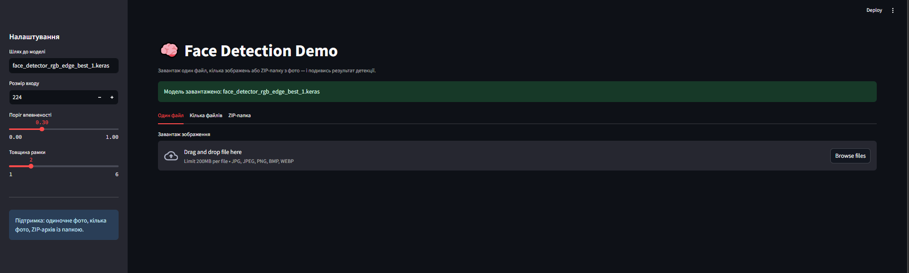
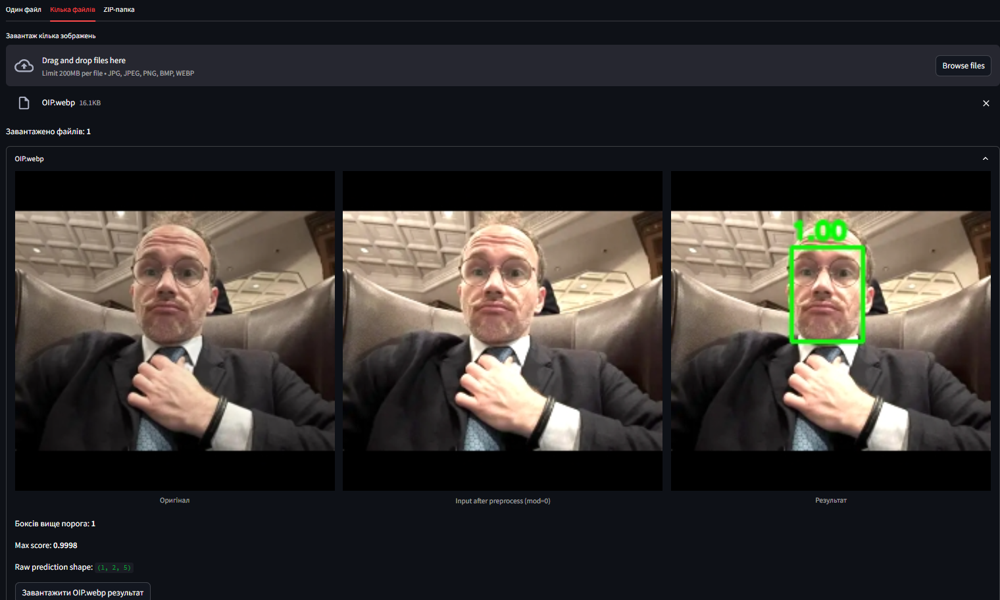
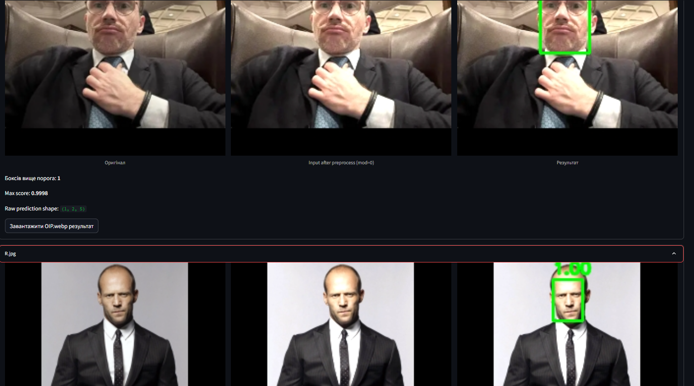

#  Гібридна система розпізнавання обрзів на складних та зашумлених зображеннях 

> Програмна система призначена для детекції облич на зображеннях із використанням двогілкової згорткової нейронної мережі, що поєднує RGB-зображення та контурне представлення для підвищення стійкості до шуму й складних умов освітлення.

---

##  Автор

- **ПІБ**: Дурягін Ростислав
- **Група**: ФЕП-42
- **Керівник**: Доц. Грабовський В.А.
- **Дата виконання**: [28.05.2026]

---

##  Загальна інформація

- **Тип проєкту**: Модель розпізнавання
- **Мова програмування**: Python
- **Фреймворки / Бібліотеки**: Streamlit, Tensorflow, skimage, sklearn

---

##  Опис функціоналу

- 3 типа завантаження зображень
- Детекція лиця
-  Попередня обробка зображення заради добавлення шуму та складного освітлення

---

## Опис основних класів / файлів

| Клас / Файл             | Призначення                |
|-------------------------|----------------------------|
| `app.py`                | Основний скріпт з візуалом |
| `face_detector_rgb_edge_best_1.keras` | Модель                     |
| `Dockerfile` | настройка docker           |

---

##  Як запустити проєкт "з нуля"

### 1. Встановлення інструментів

- Docker
- Скачати модель https://drive.google.com/drive/folders/19g58CFFwhmRDpZCfm4axBXsm7hAiDXC5?usp=sharing

### 2. Клонування репозиторію

```bash
git clone https://github.com/Rostyk-D/Face_Detection_Model.git
cd Face_Detection_Model
```
- Перекінути туда модель

### 3. Запуск

```bash
# Збірка проекту
docker build -t face-streamlit .

# Запуск проекту
docker run -p 8501:8501 -v "${PWD}:/tf/project" face-streamlit
```

---

## Інструкція для користувача

   -  Зачекати до моменту коли підвантаєжеться модель
   -  Завантажити зображення або кілька зображень для детекції лиця
   -  Настроїти персонально під себе впевненість моделі та товщину виділення рамкі

---

## 📷 Приклади / скриншоти

- **Головна Сторінка** 
- **Детекція лиця**
- **Детекція на кількох зображеннях**

(додайте зображення у папку `/screenshots/`

---

## 🧪 Проблеми і рішення

| Проблема              | Рішення                                    |
|----------------------|--------------------------------------------|
| UnidentifiedImageError:  | Перевірити розмір картинкі якщо вона менша |
| CORS помилка         | Увімкнути CORS middleware у backend        |
| Не зберігає дані     | Перевірити підключення до бази             |

---

## 🧾 Використані джерела / література

- Tenserflow документація
- Streamlit документація
- Docker офіційна
- StackOverflow
